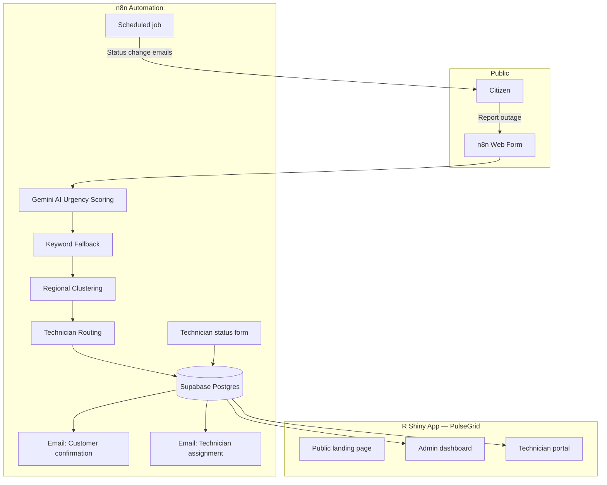

# PulseGrid — Rwanda Electricity Outage Portal

**A full-stack outage reporting and field operations platform built for Rwanda Energy Group (REG).**

Live demo: [https://psz5gu-iyampaye-ribert.shinyapps.io/elecrticty_outges/](https://psz5gu-iyampaye-ribert.shinyapps.io/elecrticty_outges/)

Report form (public): [n8n outage form](https://regrwanda.app.n8n.cloud/form/7e0ba083-f5ba-4555-aa07-2f1e34997e15)

---

## Overview

PulseGrid is an end-to-end system that lets citizens report electricity outages, automatically scores urgency with AI, routes tickets to regional technicians, and gives admins and field staff real-time operational dashboards.

The project combines:

- **R Shiny** — responsive web app (public landing page + authenticated dashboards)
- **Supabase (PostgreSQL)** — centralized ticket and user database
- **n8n** — workflow automation (intake, AI scoring, email notifications, status updates)
- **Google Gemini** — multilingual urgency classification (Kinyarwanda, French, English)

This repository is suitable as a **portfolio / hiring demo** for data science, analytics engineering, and full-stack analytics roles.

---

## Problem Statement

Utility companies receive outage reports through phone calls, social media, and walk-ins — often with incomplete location data and inconsistent priority. PulseGrid addresses this by:

1. Giving the public a structured reporting channel
2. Using AI to triage urgency and flag safety risks
3. Detecting regional outage clusters (multiple reports in a short window)
4. Assigning technicians by region automatically
5. Providing live dashboards for operations teams

---

## Architecture



---

## Key Features

### Public portal
- Modern REG-branded landing page with hero video and responsive layout
- Links to external outage report form
- Mobile-first design (iPhone, tablet, desktop)

### AI-powered triage (n8n + Gemini)
- Classifies urgency: **Low / Medium / High**
- Sets **safety_flag** for fire, sparks, shock, smoke, etc.
- Understands **Kinyarwanda, French, and English**
- **Keyword fallback** if the AI API is unavailable

### Outage clustering
- If **2+ tickets** in the same region within **3 hours**, urgency is escalated
- Helps distinguish isolated faults from area-wide grid events

### Admin dashboard
- KPI cards: total, open, high urgency, safety flags
- Filterable ticket table (region, status, urgency)
- Live charts by region and status
- Auto-refresh every 30 seconds from Supabase

### Technician portal
- Role-based login with bcrypt password hashing
- Forced password change on first login
- Personal ticket view, notifications, profile settings
- Fully responsive on mobile devices

---

## Tech Stack

| Layer | Technology |
|-------|------------|
| Frontend / App | R Shiny, bslib, bsicons, HTML/CSS/JS |
| Charts & Tables | echarts4r, DT |
| Database | Supabase (PostgreSQL) |
| Auth | bcrypt (admin + technician tables) |
| Automation | n8n (forms, Gmail, Postgres, HTTP) |
| AI | Google Gemini (urgency scoring) |
| Deployment | shinyapps.io |

---

## Project Structure

```
elecrticty_outges/
├── app.r                          # Main Shiny application
├── www/                           # Static assets (images, videos)
│   ├── hello.jpg                  # Hero poster image
│   ├── hello2.mp4                 # Hero video 1
│   ├── Video.mp4                  # Hero video 2
│   └── ...
├── n8n/
│   └── pulsegrid-workflow.template.json   # Import into n8n (secrets redacted)
├── stitch_rwanda_power_report/    # UI design references & mockups
├── .Renviron.example              # Environment variable template
├── .gitignore
└── README.md
```

---

## Database Schema (Supabase)

### `tickets`
| Column | Description |
|--------|-------------|
| ticket_id | Unique ID (Unix timestamp from n8n) |
| name, phone, email | Customer contact |
| region | kigali, huye, musanze, rubavu, nyagatare |
| description | Free-text outage description |
| status | new / New / In Progress / Resolved |
| urgency | Low / Medium / High |
| safety_flag | Yes / No |
| urgency_reason | AI or fallback explanation |
| technician, technician_email | Assigned field worker |
| time_window | Preferred contact window |
| cluster_alert, cluster_count | Outage clustering metadata |
| created_at, updated_at, notified_status | Timestamps & email tracking |

### `admins`
`id`, `name`, `email`, `password_hash`

### `technicians`
`id`, `name`, `email`, `phone`, `password_hash`, `must_change_password`, `last_login`

---

## Getting Started

### Prerequisites

- [R](https://cran.r-project.org/) (4.1+ recommended)
- [RStudio](https://posit.co/download/) (optional)
- Supabase project with Postgres credentials
- n8n instance (cloud or self-hosted) for automation

### 1. Clone the repository

```bash
git clone https://github.com/YOUR_USERNAME/pulsegrid-rwanda.git
cd pulsegrid-rwanda
```

### 2. Install R packages

```r
install.packages(c(
  "shiny", "DT", "dplyr", "echarts4r",
  "DBI", "RPostgres", "bslib", "bsicons", "bcrypt"
))
```

### 3. Configure environment

```bash
cp .Renviron.example .Renviron
```

Edit `.Renviron` and set your Supabase database password:

```
SUPABASE_DB_PASSWORD=your_password_here
```

Restart R after saving.

### 4. Run locally

```r
shiny::runApp()
```

### 5. Import n8n workflow

1. Open n8n → **Import workflow**
2. Select `n8n/pulsegrid-workflow.template.json`
3. Connect credentials: **Postgres**, **Gmail**, **Gemini API key**
4. Update technician email map in the **Clustering And Routing** node
5. Activate the workflow

---

## Deployment (shinyapps.io)

```r
install.packages("rsconnect")
rsconnect::deployApp("path/to/elecrticty_outges")
```

Ensure `www/` assets and `.Renviron` are configured on the deployment environment (use shinyapps.io environment variables for secrets — never commit `.Renviron`).

---

## Security Notes

- **Never commit** `.Renviron`, API keys, or live n8n exports with credentials
- Passwords are stored as **bcrypt hashes** only
- Database connections use **SSL** (`sslmode = require`)
- The public n8n form handles citizen intake; admin/technician areas require login

---

## What This Project Demonstrates (for recruiters)

| Skill | Evidence in this repo |
|-------|----------------------|
| Data pipeline design | n8n → Postgres → Shiny live sync |
| AI integration | Gemini urgency scoring + fallback logic |
| SQL / data modeling | Multi-table schema, ticket lifecycle |
| Data visualization | KPI dashboards, echarts4r, DT tables |
| Product thinking | Public portal + ops dashboards + field app |
| Software engineering | Auth, role-based UI, responsive CSS |
| DevOps | shinyapps.io deployment, environment config |

---

## Author

**Mukamuyango Ribert Iyampaye**  
Data Scientist — Rwanda

- Live app: [PulseGrid on shinyapps.io](https://psz5gu-iyampaye-ribert.shinyapps.io/elecrticty_outges/)
- GitHub: `YOUR_GITHUB_USERNAME` *(update after you create the repo)*

---

## License

MIT License — free to use for learning and portfolio review.

---

## Future Improvements

- [ ] In-app ticket status updates for technicians (replace external n8n form)
- [ ] SMS notifications via Africa's Talking or Twilio
- [ ] GIS map view of outage clusters
- [ ] Customer ticket lookup by ticket ID (no login)
- [ ] Standardize status/region casing across n8n and Shiny
